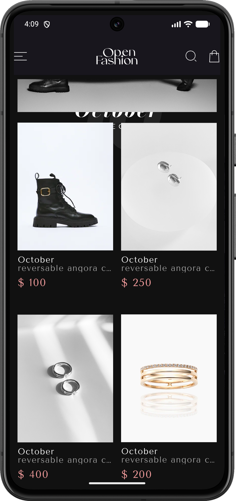
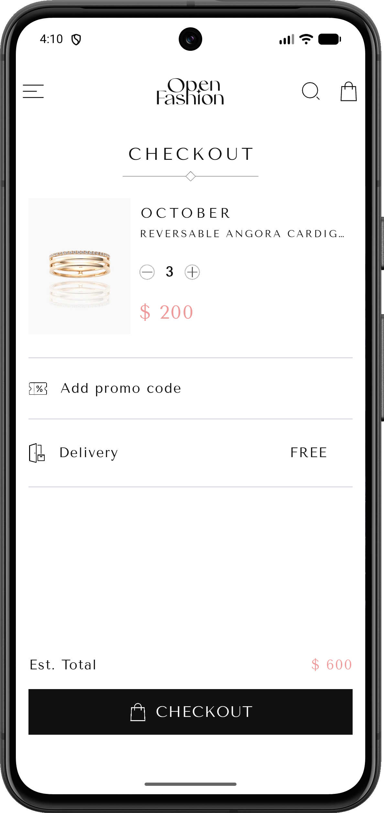
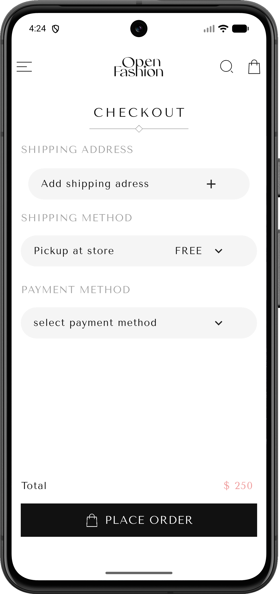
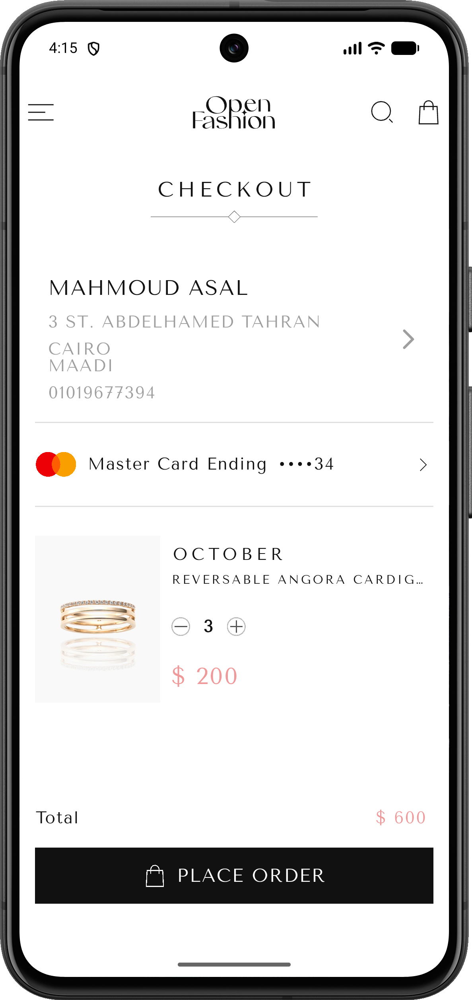
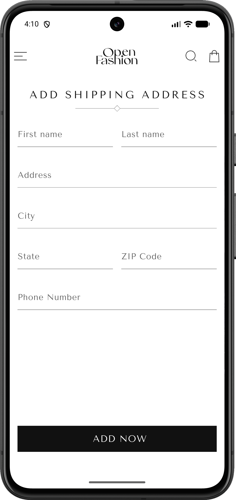
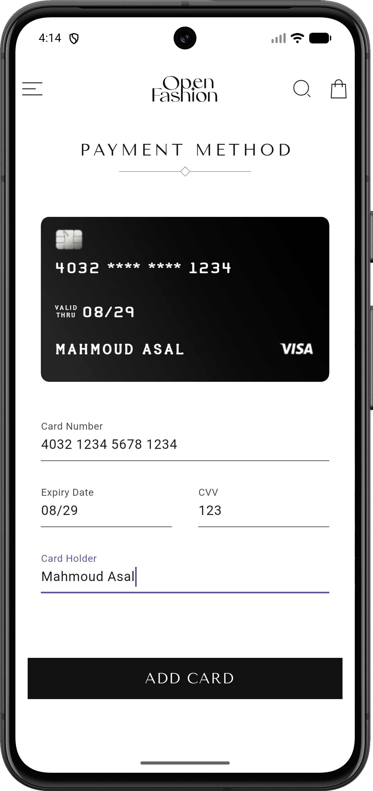
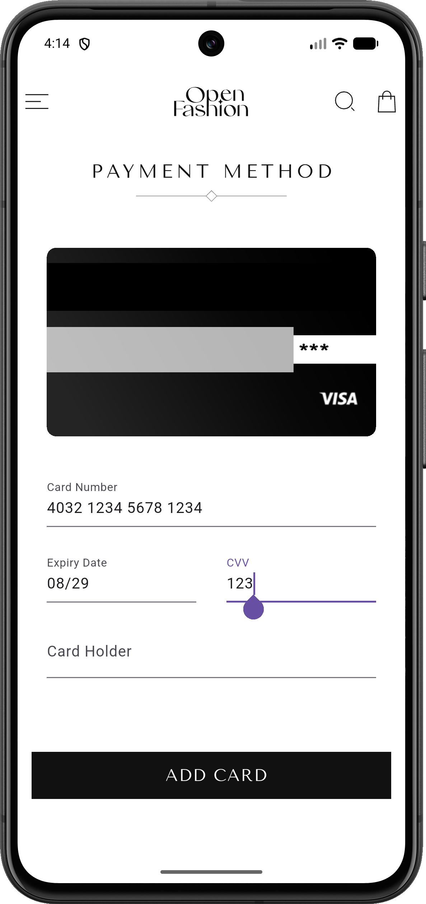
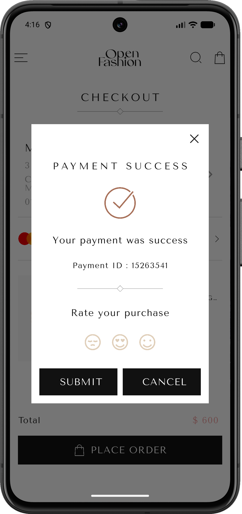

# OpenFashion

A modern, elegant e-commerce mobile application built with Flutter, designed to provide a seamless shopping experience for fashion enthusiasts.

<p align="center">
  
</p>

## 📱 Screenshots

<p align="center">
  
  
  
</p>

<p align="center">
  
  
  
</p>

<p align="center">
  
  
  
</p>

<p align="center">
  
</p>

## ✨ Features

- **Browse Collections**: Explore curated fashion collections with smooth animations
- **Product Details**: View detailed product information, descriptions, and pricing
- **Shopping Cart**: Add items to cart with dynamic quantity adjustment
- **Secure Checkout**: Complete checkout process with real-time total calculation
- **Payment Integration**: Credit card input with live preview and validation
- **Address Management**: Add and edit multiple shipping addresses
- **Order Tracking**: Real-time order confirmation with payment success dialog
- **Elegant UI**: Clean, modern design with intuitive navigation
- **Responsive**: Optimized for various screen sizes

## 🛠️ Technologies

- **Flutter SDK**: ^3.9.2
- **Dart**: Latest stable version
- **State Management**: StatefulWidget (Local state management)

### Key Packages

```yaml
dependencies:
  flutter_svg: ^2.2.3              # SVG rendering
  flutter_credit_card: ^4.1.0      # Credit card UI/validation
  gap: ^3.0.1                      # Spacing widgets
  ionicons: ^0.2.2                 # Icon library
```

## 🏗️ Architecture

```
lib/
├── main.dart
├── components/          # Reusable UI components
│   ├── cart_widget.dart
│   ├── custom_button.dart
│   ├── custom_text.dart
│   ├── custom_appbar.dart
│   └── ...
├── screens/             # Application screens
│   ├── home.dart
│   ├── product_details.dart
│   ├── checkout.dart
│   ├── place_order.dart
│   ├── add_address.dart
│   └── add_card.dart
├── models/              # Data models
│   ├── product_model.dart
│   └── cover_model.dart
└── core/                # Core utilities
    └── colors.dart
```

## 🚀 Getting Started

### Prerequisites

- Flutter SDK (^3.9.2 or higher)
- Dart SDK
- Android Studio / VS Code
- Android Emulator or iOS Simulator

### Installation

1. **Clone the repository**
   ```bash
   git clone https://github.com/yourusername/openfashion.git
   cd openfashion
   ```

2. **Install dependencies**
   ```bash
   flutter pub get
   ```

3. **Generate launcher icons** (optional)
   ```bash
   flutter pub run flutter_launcher_icons
   ```

4. **Run the app**
   ```bash
   flutter run
   ```

### Build for Production

**Android APK:**
```bash
flutter build apk --release
```

**Android App Bundle:**
```bash
flutter build appbundle --release
```

**iOS:**
```bash
flutter build ios --release
```

## 📂 Project Structure

### Key Components

- **CartWidget**: Reusable cart item component with quantity controls
- **CustomButton**: Flexible button component with SVG icon support
- **CustomTextField**: Styled text input with validation
- **AddressInfo**: Display and edit shipping addresses
- **ShippingMethod**: Shipping options selection

### Screens Flow

```
Home → Product Details → Checkout → Place Order → Payment Success
                            ↓
                    Add Address / Add Card
```

## 🎨 Design Patterns

- **Single Source of Truth**: State management using parent-child data flow
- **Stateless Widgets**: Used for presentational components
- **Callback Pattern**: Event handling from child to parent widgets
- **Composition**: Building complex UIs from simple, reusable components

## 🧪 Testing

Run tests:
```bash
flutter test
```

Run with coverage:
```bash
flutter test --coverage
```

## 📝 License

This project is licensed under the MIT License - see the [LICENSE](LICENSE) file for details.

## 👨‍💻 Author

**Your Name**
- GitHub: [@mahmoudasal](https://github.com/mahmoudasal)
- LinkedIn: [mahmoud-asal](https://www.linkedin.com/in/mahmoud-asal)

## 🤝 Contributing

Contributions, issues, and feature requests are welcome!

1. Fork the project
2. Create your feature branch (`git checkout -b feature/AmazingFeature`)
3. Commit your changes (`git commit -m 'Add some AmazingFeature'`)
4. Push to the branch (`git push origin feature/AmazingFeature`)
5. Open a Pull Request

## 📄 Changelog

### Version 1.0.0 (2025-12-09)
- Initial release
- Core shopping functionality
- Payment integration
- Address management
- Order confirmation

## 🙏 Acknowledgments

- Flutter team for the amazing framework
- Community packages contributors
- Design inspiration from modern e-commerce apps

---

<p align="center">Made with ❤️ using Flutter</p>
